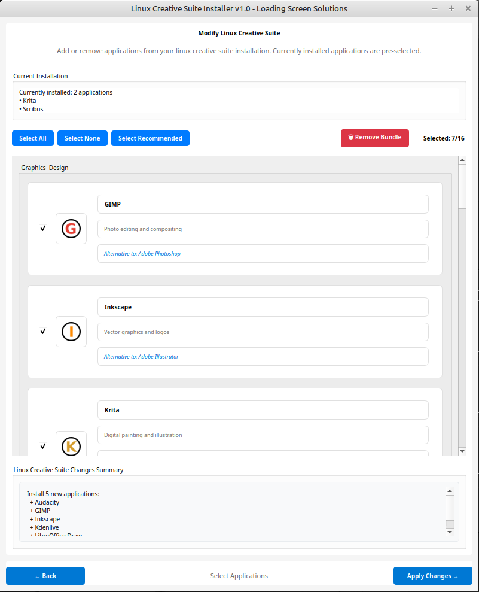

# Linux Creative Suite

An AppImage installer that provides a curated collection of open-source alternatives to Adobe Creative Cloud applications. Features a user-friendly GUI for selecting and installing applications, with custom icons and organized menu groupings in your Linux desktop environment.

## Screenshots



*The installer interface showing available applications*


*Applications organized in your desktop menu with custom icons*

## Features

- **Easy Installation**: Simple GUI-based selection and installation process
- **Custom Menu Integration**: Applications are grouped together with consistent branding
- **Custom Icons**: Unified icon theme for better visual organization
- **Multiple Installation Methods**: Supports native package managers (apt, dnf, pacman, etc.) with Flatpak fallback
- **Bundle Management**: Easily add, remove, or modify your installed applications
- **Cross-Distribution Support**: Works on Ubuntu, Mint, Fedora, Arch, openSUSE, and more

## Available Applications

The following open-source applications are available for installation:

### Graphics & Design
- **GIMP** - Photo editing and compositing (Alternative to Photoshop)
- **Inkscape** - Vector graphics and logos (Alternative to Illustrator)
- **Krita** - Digital painting and illustration (Alternative to Photoshop for Digital Art)
- **LibreOffice Draw** - Vector graphics and technical diagrams (Alternative to Illustrator for Technical Drawing)

### Video & Animation
- **Kdenlive** - Professional video editing (Alternative to Premiere Pro)
- **Blender** - 3D modeling and motion graphics (Alternative to After Effects + Dimension)
- **OpenToonz** - Professional 2D animation production (Alternative to Animate)
- **Synfig Studio** - 2D vector animation (Alternative to After Effects for 2D)

### Publishing & Layout
- **Scribus** - Desktop publishing for magazines and books (Alternative to InDesign)

### Photography
- **darktable** - Professional RAW photo workflow (Alternative to Lightroom)
- **RawTherapee** - Advanced RAW photo processing (Alternative to Lightroom)

### Audio Production
- **Audacity** - Audio recording and editing (Alternative to Audition)

### Web Design
- **BlueGriffon** - Visual web page editor (Alternative to Dreamweaver)

### UI/UX Design
- **Figma** - Collaborative UI/UX design and prototyping (Alternative to XD)
- **Penpot** - Open-source design and prototyping platform (Alternative to XD)

### Document Viewing
- **Okular** - Universal document viewer with annotation tools (Alternative to Acrobat Reader DC)

## System Requirements

- **Operating System**: Linux (Ubuntu 18.04+, Fedora 30+, Arch Linux, openSUSE, Linux Mint, etc.)
- **Architecture**: x86_64 (64-bit)
- **Desktop Environment**: Any (GNOME, KDE, XFCE, etc.)
- **Dependencies**: Modern glibc, GTK+ libraries (usually pre-installed)
- **Permissions**: Standard user account with sudo access for package installation

## Installation & Usage

### Quick Start

1. **Download**: Get the latest AppImage from the [Releases page](https://github.com/LoadingScreenSolutions/linux-creative-suite/releases)
2. **Make Executable**: Right-click the downloaded file → Properties → Permissions → "Allow executing file as program" 
   
   *Or via terminal:*
   ```bash
   chmod +x Linux-Creative-Suite-*.AppImage
   ```
3. **Run**: Double-click the AppImage file to launch the installer

### Using the Installer

The installer guides you through a simple 3-step process:

1. **Welcome Screen**: Overview of available applications and what they do
2. **Application Selection**: Choose which applications to install
   - Pre-selected recommendations for common creative workflows
   - Detailed descriptions showing what each app does
   - Adobe equivalents clearly marked
   - Visual icons for easy identification
3. **Automated Installation**: Sit back while the installer:
   - Downloads and installs your selected applications
   - Sets up custom icons and menu organization
   - Creates a unified "Creative Suite" category in your applications menu

### After Installation

- **Find Your Apps**: Look for the "Creative Suite" category in your applications menu
- **Modify Anytime**: Re-run the AppImage to add or remove applications from your bundle
- **Clean Removal**: Use the "Remove Bundle" option to remove menu integration while keeping applications
- **Individual Management**: Each application can still be managed through your system's normal package manager

### No Installation Required

The installer itself is portable - no need to install anything on your system. The AppImage contains everything needed to run the installer, and you can delete it after use or keep it for future modifications to your Creative Suite bundle.

## Technical Details

### Installation Methods
1. **Native Package Manager** (Primary): Uses your distribution's package manager (apt, dnf, pacman, zypper)
2. **Flatpak** (Fallback): Universal Linux application format
3. **Snap** (Last Resort): Ubuntu's universal package format

### File Locations
- **Desktop Files**: `~/.local/share/applications/`
- **Icons**: `~/.local/share/icons/`
- **Categories**: `~/.local/share/desktop-directories/`

### Supported Distributions
- **Debian/Ubuntu Family**: Ubuntu, Linux Mint, Pop!_OS, elementary OS
- **Red Hat Family**: Fedora, CentOS, RHEL, Rocky Linux
- **Arch Family**: Arch Linux, Manjaro, EndeavourOS
- **SUSE Family**: openSUSE Leap, openSUSE Tumbleweed
- **Other**: Most modern Linux distributions with standard package managers

## Building from Source (For Developers)

If you want to modify the installer or contribute to development:

### Prerequisites
```bash
# Ubuntu/Debian
sudo apt install python3 python3-pip python3-tk python3-pil python3-pil.imagetk

# Fedora
sudo dnf install python3 python3-pip python3-tkinter python3-pillow python3-pillow-tk

# Arch
sudo pacman -S python python-pip tk python-pillow
```

### Clone and Run
```bash
git clone https://github.com/LoadingScreenSolutions/linux-creative-suite.git
cd linux-creative-suite
python3 src/main.py
```

### Build AppImage
```bash
cd build
./build_appimage.sh
```

## Contributing

We welcome contributions! Please see our [Contributing Guidelines](CONTRIBUTING.md) for details on how to:

- Report bugs and request features
- Submit code improvements
- Add support for new applications
- Improve documentation

## License

This project is licensed under the MIT License - see the [LICENSE](LICENSE) file for details.

## About Loading Screen Solutions

Linux Creative Suite is developed by [Loading Screen Solutions](https://loadingscreensolutions.com), a technology consulting company focused on empowering users to leverage open-source alternatives to proprietary software.

**Mission**: Technology consulting & liberation through open-source solutions.

## Support

- **Issues**: [GitHub Issues](https://github.com/LoadingScreenSolutions/linux-creative-suite/issues)
- **Discussions**: [GitHub Discussions](https://github.com/LoadingScreenSolutions/linux-creative-suite/discussions)
- **Documentation**: [Wiki](https://github.com/LoadingScreenSolutions/linux-creative-suite/wiki)

## Acknowledgments

- All the amazing open-source developers who created these fantastic alternatives to proprietary software
- The Linux desktop environment maintainers who make application integration possible
- The community for feedback, testing, and contributions

---

**Disclaimer**: This project is not affiliated with, endorsed by, or sponsored by Adobe Inc. Adobe, Creative Cloud, Photoshop, Illustrator, Premiere Pro, After Effects, InDesign, Lightroom, Audition, Dreamweaver, XD, and other Adobe product names are trademarks or registered trademarks of Adobe Inc. in the United States and/or other countries. All other trademarks mentioned are the property of their respective owners. This software provides open-source alternatives and is developed independently.
